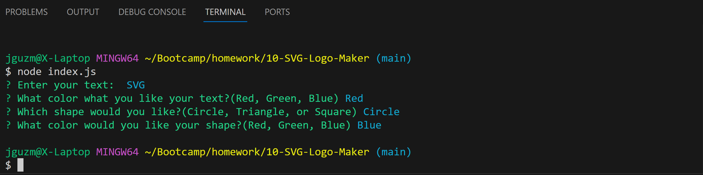

# SVG Logo Maker

## Description

This application generates a logo as a .svg file. The file created is resulted from the options the user has selected.

## Installation

N/A, runs in the terminal.

## Usage

The user is prompted with questions 

## Mock-Up

The following image shows the web application's appearance and functionality: 

## Video Link

https://drive.google.com/file/d/1fCgKXJvzlsZ9AHrtSdfMSNwx5h8MTv0o/view?usp=drive_link

## Built With

-Jest

## Tests

The test for each of the shape contructors are ran using Jest, the test can be ran by moding the paramaters in the contructors and test files.
